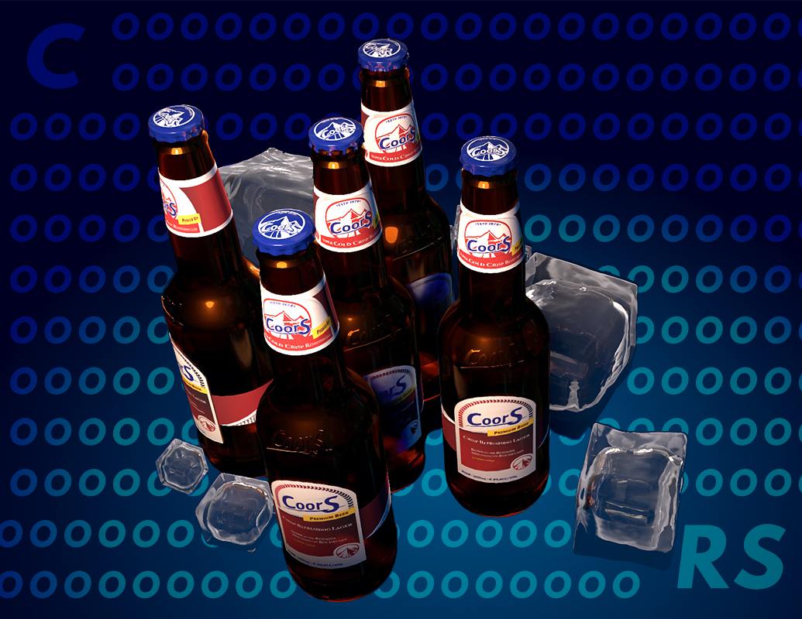

# Final Intergrated Project
The website is a fictional beer brand that mashed up by Coors and Gas-X. The new brand "CoorS" takes style feature of Gas-X and the product content of Coors.

## Prerequisites
Only need a browser to view the website.

## Usage
Download or clone this project and <kbd>cd</kbd> to your directory, and look through the website.

- The website starts from Validation page, though it hasn't linked to homepage yet.
- On About page, you can click on the image to expand each paragraph.
- On Product page, click on the rounded icons to view different products.
- On Commercials page, select from the play list to view advertisements.

## License
MIT License

Copyright (c) 2021 lightbluecactus(Yan Kang)

Permission is hereby granted, free of charge, to any person obtaining a copy
of this software and associated documentation files (the "Software"), to deal
in the Software without restriction, including without limitation the rights
to use, copy, modify, merge, publish, distribute, sublicense, and/or sell
copies of the Software, and to permit persons to whom the Software is
furnished to do so, subject to the following conditions:

The above copyright notice and this permission notice shall be included in all
copies or substantial portions of the Software.

THE SOFTWARE IS PROVIDED "AS IS", WITHOUT WARRANTY OF ANY KIND, EXPRESS OR
IMPLIED, INCLUDING BUT NOT LIMITED TO THE WARRANTIES OF MERCHANTABILITY,
FITNESS FOR A PARTICULAR PURPOSE AND NONINFRINGEMENT. IN NO EVENT SHALL THE
AUTHORS OR COPYRIGHT HOLDERS BE LIABLE FOR ANY CLAIM, DAMAGES OR OTHER
LIABILITY, WHETHER IN AN ACTION OF CONTRACT, TORT OR OTHERWISE, ARISING FROM,
OUT OF OR IN CONNECTION WITH THE SOFTWARE OR THE USE OR OTHER DEALINGS IN THE
SOFTWARE.
